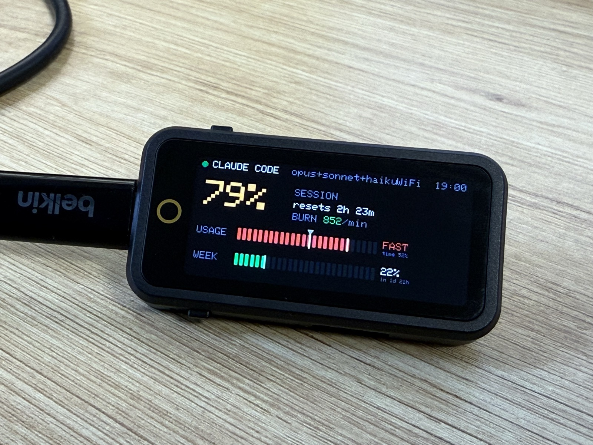

# Claude 사용량 미터기 — 제작 공유

작은 AMOLED 디스플레이에 **Claude Code 사용량(세션/주간 한도)을 실시간으로 띄우는 데스크 미터기**.
ESP32 펌웨어 + Mac 헬퍼로 직접 만들었습니다. 만들면서 겪은 함정과 배운 점을 공유합니다.

> 제품: **LILYGO T-Display AMOLED Plus (ESP32-S3)**
> https://ko.aliexpress.com/item/1005008722521317.html


<!-- 사진: images/meter-front.jpg 에 책상 위 정면 샷을 넣으세요 -->

---

## 1. 뭐고, 왜 만들었나
- 코딩 중 "지금 한도에 얼마나 가까운지"를 책상에서 **흘깃 보려고**.
- Claude Code(Pro/Max)는 **5시간 세션 한도 + 7일 주간 한도**가 있어서, 모르고 쓰다 갑자기 막히면 흐름이 끊깁니다. 미리 보면 속도 조절이 가능.
- 핵심 화면: **세션 %(대형) + USAGE↔TIME 페이스 비교 + 주간 % + 번레이트**.

## 2. 부품 & 비용
| | |
|---|---|
| 보드 | LILYGO T-Display AMOLED **Plus** (ESP32-S3) |
| 화면 | 1.91" AMOLED **536×240**, RM67162, **SPI 인터페이스** |
| 사양 | 16MB Flash, 8MB PSRAM, WiFi + BT5, USB-C, 정전식 터치(CST816), 충전 IC(BQ25896) |
| 그 외 | 데이터 지원 USB-C 케이블 1개 |
| 가격 | 약 **$20–30** (배송 별도) |

추가 납땜·부품 없음. USB-C만 꽂으면 됨.

## 3. 동작 구조
```
~/.claude 로그  +  Claude Code statusLine(상태줄) 훅
   │ ccusage = 토큰/비용 "추정"      │ statusLine = "진짜" 한도 %
   └──────────────┬─────────────────┘
                  ▼
        [Mac] Node 헬퍼 서버 (launchd 상시 실행)
                  │  HTTP/JSON   (또는 USB-C 시리얼)
                  ▼
        [ESP32] WiFi 폴링 → AMOLED 렌더링
```
- 그리기: Arduino_GFX 캔버스(PSRAM)에 그린 뒤 패널로 push.
- 전송 2가지: **WiFi**(집/사내 허용망) 또는 **USB-C 시리얼**(WiFi 인증 막힌 곳).

## 4. 화면 보는 법
- **큰 % = 5시간 세션 사용률** (60%↑ 주황, 90%↑ 빨강)
- **USAGE 바** = 세션 사용률(초록) + **흰 삼각형(시간 진행 위치)** → 둘을 비교해 "시간보다 빨리 쓰나" 판단 → `EASY / ON PACE / FAST`
- **WEEK 바** = 주간 한도
- **BURN** = 분당 토큰, **좌상단 점 깜빡임 속도** = 현재 사용 속도

## 5. 개발 하이라이트 & 배운 점 (= 삽질 모음, 제일 유용)
1. **"Plus"는 QSPI가 아니라 SPI 변종.** 흔한 1.91" 예제(QSPI 드라이버)로는 **화면이 깜깜**. LilyGo 라이브러리의 `beginAMOLED_191_SPI()`(자동감지 `begin()`)를 써야 함.
2. **색이 분홍으로 깨짐 = 엔디안 버그.** ESP32 프레임버퍼는 리틀엔디안인데 패널은 빅엔디안 RGB565 → **모든 색 바이트가 뒤바뀜**. 흰/회색은 R≈G≈B라 멀쩡해 보여서 한참 못 찾음(코랄→분홍). **모든 색을 미리 바이트 스왑**해서 해결.
3. **라이브러리 버전 함정.** Arduino_GFX는 **1.4.7로 고정**(1.5+는 Arduino core 3.x 필요). LilyGo 라이브러리는 LVGL/TFT_eSPI 예제 의존성을 **떼고 벤더링**(안 그러면 `lvgl.h` 못 찾아 빌드 실패).
4. **Node 22+ 필요.** ccusage가 최신 Node 기능 사용(구버전이면 `Object is not disposable`).
5. **추정치 ≠ 진짜 한도.** ccusage는 로컬 로그로 토큰/비용을 *추정*. 앱의 "Plan usage limits"(세션 95% 등)는 **서버가 주는 진짜 값** — 둘은 다름.
6. **진짜 한도는 statusLine 훅으로.** Claude Code가 상태줄 명령에 넘기는 JSON에 `rate_limits.five_hour / seven_day`, `context_window`가 들어있음 → **공식 지원 훅**이라 미공개 엔드포인트/토큰 없이 가져옴.
7. **데스크톱 앱은 샌드박스.** 훅 스크립트를 **`~/.claude/` 안**(샌드박스 접근 가능 경로)에 둬야 함. 호스트 임의 경로(`~/projects/…`)는 못 읽음.
8. **갱신은 "활동 기반".** 상태줄이 다시 그려질 때(메시지·작업 중)만 갱신. 놀 땐 멈춤(어차피 사용량도 안 변하니 값은 정확). 5분 넘으면 **STALE** 표시.
9. **정직한 표시.** 처음엔 번레이트로 숫자를 부드럽게 올렸는데(연출), 실제 소비는 튀어서 **"정직 모드"**(진짜 값에서만 이동)로 바꿈. 동적 느낌은 **깜빡이는 점**으로.
10. **화면을 못 보고 디버깅.** 보드 화면을 직접 못 보는 상태라, 색/레이아웃을 **시리얼 로그 + 수치 계산 + 사용자 피드백**으로 잡음(엔디안도 코랄→분홍 색 계산으로 추론).

## 6. 주의사항
- ESP32는 **2.4GHz WiFi만** 지원.
- 진짜 한도%는 **Claude Code가 켜져 활동할 때만** 갱신(활동 기반, 연속 폴링 아님).
- **데스크톱 앱이 훅을 실행하는지는 환경 따라 다를 수 있음** — 터미널 CLI는 확실히 동작.
- statusLine 설정 시 CLI 상태줄 표시가 바뀜(보너스, 되돌리기 쉬움).
- 토큰/비용은 추정치이고, % 한도는 진짜지만 **정확한 허용량은 플랜/시점 따라 다름**.
- AMOLED 상시 표시 → **번인 주의**(자동 디밍 권장).

## 7. 재현하려면
- 전체 코드/셋업은 프로젝트 **README** 참고.
- 요약: **PlatformIO로 펌웨어 플래시** + **Mac에서 Node 헬퍼(launchd) 실행** + WiFi/서버 IP를 `config.h`에 설정.
- 사내망(WiFi 인증) 환경이면 WiFi 대신 **USB-C 시리얼 모드** 사용.

---
*만든 사람: (이름) · 문의 환영*
